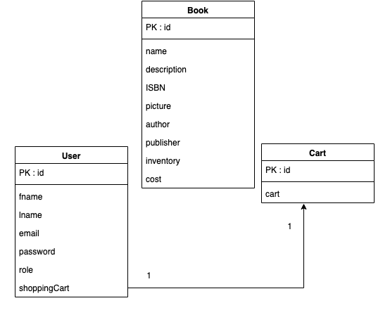
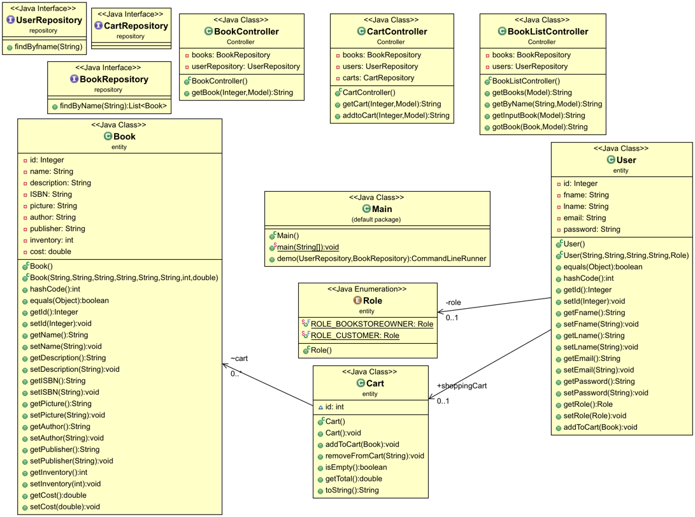

# SYSC4806_Amazin_bookstore 

### Status

#### *Team Noob Members:*

 - Rayhaan Dustagheer 
 - Tareq Hanafi 
 - Nnamdi Okwechime 
 - Manel Oudjida 
 - Kyle Smith	 

------------------------------------------------------------------------------------------------------------
###Background:

Build a Web Application, using the Spring MVC framework that will allow Bookstore Owner to upload and edit Book information and inventory. And Users will have the option to search, and browse through, the books in the bookstore. User have the option to decide to purchase one or many books by adding them in the Shopping Cart and proceeding to Checkout. 

This web app named Amazin is a simulation of an online bookstore that is inspired by Amazon. 

------------------------------------------------------------------------------------------------------------
###Packages descriptions

- Entity: represents a table in a database. Each entity instance corresponds to a row in that table such as book,user,cart...

- Repository: represents Data Access Object. It is for accessing relevant entities needed such as UserRepository,BookRepository,CartRepository

- Controller: represents part of the mvc pattern which controls the flow of data.  controllers such as UserController,BookController, AuthenticationController, CartController...

- Resources/Templates: All html pages, css and javascript that would be displayed

------------------------------------------------------------------------------------------------------------
###Features:

- User can search, browse through the books in bookstore, sort and filter based on desired information.
- User - Bookstore owner can add book, edit book and inventory
- Book features are ISBN, picture, description, author, pubilisher...
- User features are firstname, last name, email, password, role 
- User-customer can add books in cart
- Cart is saved to the users' account and loads after login.
- User can purchase book(s) in cart, if they don't exceed inventory.
- Search bar to help user filter books desired
- Show user book recommendations based on searches.

------------------------------------------------------------------------------------------------------------
###Diagrams:

- Database Diagram:

- UML Diagram:

------------------------------------------------------------------------------------------------------------
###Setup:

To access the heroku web app: [Amazin](https://sysc4806amazin.herokuapp.com)

------------------------------------------------------------------------------------------------------------

###Milestones Breakdown

Questions:
1. what have I done this week? 
2. what will I do next week? (only for milestone 1 & 2)

-----------------------------------------------------------------------------
Milestone 3 Task:

*Mohammad Goolam Dustagheer*

*Tareq Hanafi*

*Nnamdi Okwechime*
1.

*Manel Oudjida*
1. Completed signup feature , login feature with forgot password feature, wrong input feature, landing page , css implementation to landing page, readme documentation , UML and database diagrams.

*Kyle Smith*
1. Completed the recommended section feature and purchase history feature with implementation of html pages bookList, Book...

--------

Milestone 2 Task:

*Mohammad Goolam Dustagheer*

1. Implementation of the search bar
2. Add some CSS features

*Tareq Hanafi*

1. Implementation of the login and sign up pages.
2. complete the implementation of the login and sign up pages

*Nnamdi Okwechime*

1. Implementation of add cart feature

2. Implementation of cartController & CartView.

*Manel Oudjida (100945382)*
1. Implementation of forget password, CSS and project documentation and UML class diagram.
2. Implementation of the forget password & reset password

----------

Milestone 1 Task:

*Mohammad Goolam Dustagheer*

1. Responsible for the Implementaion of testing classes (user & book)
2. Implementing the forget login page and reset password with controller/email.

*Tareq Hanafi*

1. Implementation of the login and sign up pages.
2. Implementation of the user repository with the pages, along with figuring out how to implement 3rd party authentication.

*Nnamdi Okwechime*
1.Reponsible for the implementation of Cart and the cartTest. Setting up the project Travis CI and heroku
2.Implementation of cartController & CartView.

*Manel Oudjida (100945382)*
1. Setting up the project on github. Responsible for the implementation of Entity classes (User, Role, Book) & repository classes(Bookrepository, userRepository). Project documentation and UML class diagram.
2. Implementation of the forgot password, and resert password feature

*Kyle Smith*
1. Setup the project as a springbootapplication, made the landing page, add book page, view book page, and their controllers. Also fixed annotations on the repos to make them CRUD.
2. Restrict the add book page to only the owner user, add additional functionality to the view book page for owners, possibly implement a search bar on the booklist/home page.

------------------------------------------------------------------------------------------------------------
